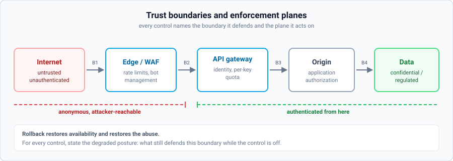
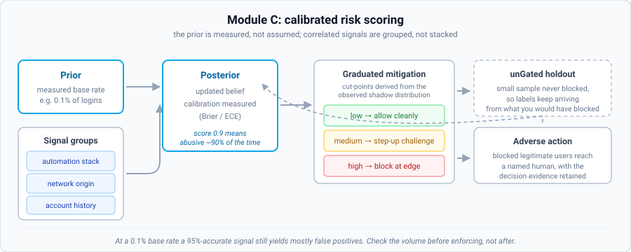
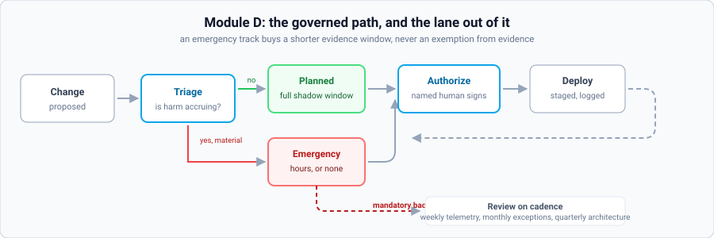

# DAVE+R Framework
**Define • Architect • Validate • Execute • Refine**  
*A vendor-neutral operating framework for secure cloud, edge/WAF, and abuse-resilient delivery.*

**Public Reference v1.1.0** • **28 Aug 2026**  
Created by **Demetrios Petropoulos**

---

> [!NOTE]
> **Purpose:** Give teams a repeatable, auditable way to expand security controls without breaking business traffic — and to keep improving as the system and adversaries evolve.

> [!IMPORTANT]
> **New in v1.1.0.** Every stage gained requirements that v1.0.0 left implicit. The
> short version: urgency is now triaged instead of assumed, enforcement must be earned
> against a measured baseline, Validate asks how the control will be evaded, exceptions
> carry a compensating control and a defined expiry action, and Module C states the
> statistical obligations that make a risk score trustworthy. Every change is listed in
> [CHANGELOG.md](CHANGELOG.md).
>
> The framework is now also **machine-executable**. See [Running DAVE+R with agents](#running-daver-with-agents)
> and the [`ai/`](ai/) directory.

## Table of Contents
- [Executive Summary](#executive-summary)
- [Who It Helps](#who-it-helps)
- [How to Use It](#how-to-use-it)
- [Core Principles](#core-principles)
- [The DAVE+R Lifecycle](#the-daver-lifecycle)
  - [0) Triage](#0-triage)
  - [1) Define](#1-define)
  - [2) Architect](#2-architect)
  - [3) Validate](#3-validate)
  - [4) Execute](#4-execute)
  - [5) Refine](#5-refine)
- [Implementation Modules](#implementation-modules)
  - [Module A — Edge and WAF Expansion](#module-a--edge-and-waf-expansion)
  - [Module B — Cloud Posture and Connectivity](#module-b--cloud-posture-and-connectivity)
  - [Module C — Bot and Fraud Defense (Bayesian Extension)](#module-c--bot-and-fraud-defense-bayesian-extension)
  - [Module D — Governance and Delivery](#module-d--governance-and-delivery)
- [Metrics That Define Success](#metrics-that-define-success)
- [Running DAVE+R with agents](#running-daver-with-agents)
- [Publishing, Attribution, and Versioning](#publishing-attribution-and-versioning)
- [Appendix — Starter Templates](#appendix--starter-templates)
- [License](#license)

---

## Executive Summary
**DAVE+R** is a practical lifecycle for teams that need to expand cloud and edge security safely, repeatedly, and with measurable outcomes. It is designed for environments where **availability**, **customer experience**, and **security** must all hold at once — and where changes must be **governed**, **reversible**, and **observable**.

The framework is **vendor-neutral by design**: it can be implemented with any cloud provider, WAF/CDN, identity platform, and fraud tooling. The differentiator is not a specific product — it is **disciplined execution**.

**DAVE+R stages:** Define → Architect → Validate → Execute → Refine

---

## Who It Helps
Security and platform teams scaling WAF/edge controls, cloud connectivity and posture, bot/fraud defenses, and the governance that keeps all of that maintainable.

---

## How to Use It
Run every meaningful change through the **DAVE+R loop**. Treat output artifacts (briefs, control matrices, validation reports, and refinement logs) as **first-class deliverables**.

> [!TIP]
> Use the lifecycle for both “big” initiatives and “small” rule changes. Depth scales with risk; the stages remain consistent.

---

## Core Principles
- **No scope, no change:** If success criteria, constraints, and owners are not written down, the system is not ready for enforcement changes.
- **Default to safe, then prove exceptions:** Exceptions are allowed, but they are justified, time-bounded, visible, and reviewed.
- **Prefer modular controls over monolith rules:** Small, named, explainable units scale better than fragile mega-rules.
- **Log first, enforce second, refine always:** Production is the truth serum. Enforcement is earned with evidence.
- **Measurable outcomes over vibes:** Decisions must be defensible with telemetry, tests, and documented tradeoffs.
- **Governance is a feature:** Auditable change control enables speed without fear.
- **Urgency is triaged, not assumed.** *(v1.1)* Choosing to run a full validation cycle while an attack is causing damage is a legitimate decision, and so is shortening it. What is not legitimate is making that choice by default and calling it discipline. Every cycle declares a track and, when harm is accruing, states what a day of inaction costs.
- **A control you cannot evade on paper is a control you have not tested.** *(v1.1)* If you cannot name three ways around your own rule, you do not yet understand it well enough to enforce it.

---

## The DAVE+R Lifecycle
Each stage has explicit intent, required outputs, and exit criteria. Teams can scale the depth of each stage based on risk, but should not skip stages.

### 0) Triage
*New in v1.1.0. Not a sixth stage: a gate at the front of Define that decides how deep the next four go.*

**Intent:** Decide how much evidence this change can afford to wait for, before anyone starts gathering it.

v1.0.0 assumed every cycle was a planned expansion. Real cycles frequently start mid-incident, and a framework that offers only one speed will be either abandoned under pressure or followed at a cost nobody agreed to pay. Triage makes the trade explicit and attributable.

**The three tracks**

| Track | When | Shadow window | Approval | Backfill |
| :--- | :--- | :--- | :--- | :--- |
| **Planned** | No harm accruing, or harm is tolerable and accepted in writing | Module default | Accountable owner | n/a |
| **Expedited** | Harm accruing, containable, evidence obtainable quickly | Shortened, module-defined | Accountable owner, explicitly | Within module window |
| **Emergency** | Active material harm, every hour has a cost | Hours, or none | Accountable owner plus incident commander | Mandatory |

**Key activities**
- Establish whether harm is accruing right now, from telemetry rather than from the room's mood.
- Quantify the cost of a day of not acting. This is the number that makes the trade real.
- Select the track and record who accepted it.

**Exit criteria**
- Track selected and justified.
- If harm is accruing and the planned track was chosen anyway, the accountable owner has signed for the ongoing loss.

> [!IMPORTANT]
> An emergency track buys a **shorter evidence window**, never an exemption from evidence. The baseline, the evasion analysis and the change record are still required, backfilled within the module's window. Emergency changes that are never backfilled are how a governed system quietly becomes an ungoverned one.

---

### 1) Define
**Intent:** Turn ambiguity into an executable target.

**Key activities**
- Identify assets (apps, APIs, flows, regions, user segments, data sensitivity).
- Define threat and abuse scenarios for the asset, not in the abstract. **Each threat must have an observable signature.** *(v1.1)* If you cannot say how a threat appears in telemetry, you cannot validate the control that addresses it.
- **Consider alternatives before committing to a control.** *(v1.1)* Name at least one option on a different enforcement plane, including any fix to the underlying cause, and say why it was rejected. A framework that starts every cycle at "which rule shall we write" will keep pushing problems to the edge whether or not the edge is the right place for them.
- Document constraints (latency, UX, compliance, operational limits, cost).
- Set measurable success metrics and guardrails (what must not break), **with a measured current value for each.** *(v1.1)*

**Core outputs**
- Definition Brief (one page).
- Top abuse/threat scenarios and assumptions, each with an observable signature.
- Success metrics with **baselines**, and numeric guardrails.
- Considered alternatives and the reason each was rejected.
- Owners and escalation paths (RACI), with **one named accountable individual**.

**Exit criteria**
- Stakeholders agree on what success and failure look like.
- Constraints are explicit, accepted, and expressed as numbers. *(v1.1: a false positive tolerance of exactly zero is not a valid guardrail. No statistical control can guarantee it, so declaring it guarantees a later argument instead of a later measurement.)*
- A baseline exists for every success metric, measured before anything ships.
- Exactly one person is accountable. A team name is not an owner.

---

### 2) Architect
**Intent:** Design a control system that scales and can be operated safely.

**Key activities**
- Map trust boundaries (client → edge → origin → services → data).
- Decide enforcement planes (edge/WAF, identity, network, application layer).
- Define policy tiers (baseline plus overlays; inheritance and exceptions).
- Design observability (logs, metrics, alerts) and rollback strategy, **including rollback granularity and the degraded posture.** *(v1.1)*

**Core outputs**
- Trust boundary diagram and data flow notes.
- Control matrix (control → plane → owner → telemetry → rollback → **granularity → degraded posture**).
- Policy tier model and exception approach.
- Logging and monitoring plan.

**Exit criteria**
- Every control has an owner, telemetry, and rollback.
- **Every control traces to at least one declared threat scenario.** *(v1.1)* A control that addresses nothing written down is either solving an unrecorded problem or is cargo cult.
- Architecture supports incremental rollout.
- Exceptions are governable (not informal).

> [!NOTE]
> **On degraded posture.** *(v1.1)* Rollback restores availability and simultaneously restores the abuse. The attack does not pause while you are rolled back. State what protects the asset during that window. "Nothing" is an acceptable answer; not having considered it is not.

---

### 3) Validate
**Intent:** Earn enforcement through proof and calibration.

**Key activities**
- **Measure the baseline before shadow mode starts.** *(v1.1)*
- Run changes in log/preview/shadow mode where possible.
- Test abuse scenarios and failure modes (including rollback).
- Measure false positives on critical flows, **individually, not only in aggregate.** *(v1.1)*
- **Perform an evasion analysis.** *(v1.1)* Name at least three ways to defeat the control, test at least one, and give every one a disposition of mitigated, accepted or deferred. An accepted bypass requires a named signature.
- Calibrate thresholds and exception rules before enforcement.

**Core outputs**
- Validation plan (scenarios and expected outcomes).
- Baseline measurements taken before any change.
- Evasion analysis with dispositions.
- Findings report (risk, impact, decision).
- Tuned policies ready for staged enforcement.
- Exception register (owner, rationale, expiry, **expiry action, compensating control, blast radius**).

**Exit criteria**
- False positives are within tolerance for critical flows, measured per flow.
- Performance impact is measured and acceptable.
- Rollback is tested and accessible.
- Known trivial bypasses are documented and either mitigated or accepted in writing.
- Go/no-go is signed by the accountable individual named in Define.

> [!WARNING]
> **Why aggregate false positive rates hide outages.** *(v1.1)* If login is 2% of traffic and is 100% broken, the aggregate false positive rate reads 2%. Break the measurement down by each critical flow enumerated in the brief.

> [!NOTE]
> **On threshold controls.** *(v1.1)* Compute how much of their goal an attacker retains operating just below your threshold. If the answer is most of it, you have bought time rather than built a fix, and lowering the number again will buy less time next quarter. Escalating the control class is the real answer: authentication, per-key quotas, cost-based challenges, or a different plane entirely.

---

### 4) Execute
**Intent:** Deploy with discipline and governance, not heroics.

**Key activities**
- Implement via CI/CD or controlled change paths.
- Roll out in stages (canary → segment → region → full), **each with an abort criterion agreed in advance.** *(v1.1)*
- Monitor KPIs continuously during rollout.
- **Confirm dashboards and alert routing are live before enforcing, by querying them.** *(v1.1)*
- Publish runbooks and escalation paths.

**Core outputs**
- Change record and release notes.
- Versioned control set (baseline plus overlays).
- Dashboards and alert routing, verified live.
- Operational runbooks including safe-disable path.

**Exit criteria**
- Controls are live, monitored, and owned.
- Rollback plan is rehearsed, not merely written.
- Enforcement is authorized by the accountable individual.
- Change is auditable end-to-end.
- **If this cycle used the emergency track, the backfill obligation is discharged or explicitly scheduled.** *(v1.1)*

> [!IMPORTANT]
> A rollout stage with no abort criterion is not staged. It is just slow. Decide the number that halts the rollout before the pressure starts, because you will not decide it well at 2am with the VP on the call.

---

### 5) Refine
**Intent:** Use production evidence to harden, simplify, and keep pace with adversaries.

**Key activities**
- Review telemetry routinely for drift and new patterns.
- **Sweep the exception register for expiries.** *(v1.1)* An exception past its expiry with no recorded action is not renewed. It is drift with a date stamp on it.
- Reduce complexity safely (retire dead rules and exceptions).
- **Re-run the evasion analysis at least quarterly.** *(v1.1)* Adversaries adapt between cycles, so an analysis from three quarters ago describes a different opponent.
- Update baselines and overlays as the system changes.
- Feed learnings back into the next Define phase.

**Core outputs**
- Refinement log (what changed, why, impact), every entry citing observed evidence.
- **Complexity trend: control count, exception count, mean exception age.** *(v1.1)*
- Updated policy sets and documentation.
- Version bump and changelog.
- Retired exception list and cleanup evidence.

**Exit criteria**
- The system becomes simpler and/or stronger over time, **and you can show the counts that prove it.** *(v1.1)*
- Metrics show improvement or deliberate, documented tradeoffs.
- Changes remain traceable to evidence.
- **No exception sits past expiry without a recorded decision.** *(v1.1)*

> [!WARNING]
> **The ratchet trap.** *(v1.1)* Three adjustments to the same threshold is the signature of a control class that is losing. Each tune buys less time than the last while the rule set gets harder to reason about. When you see the third one coming, change the class of control instead of the number.

---

## Implementation Modules
Modules are practical implementations of DAVE+R in specific domains. Each module uses the same lifecycle and produces compatible artifacts.

### Module A — Edge and WAF Expansion
**Purpose:** Expand edge protection without breaking business traffic.

**Key practices**
- Baseline policies plus app/API overlays; exceptions are time-bounded and reviewed.
- Log-first rollouts: log → simulate → partial enforce → full enforce.
- Explicit protection of critical flows from accidental breakage, with a safety test per flow. *(v1.1)*
- Clear naming conventions and modular rule design.

**Exception mechanism strength** *(v1.1)*

The bypass mechanism is itself an attack surface. Prefer, in order:

1. Cryptographic identity
2. mTLS
3. Signed header
4. API key
5. IP address
6. ASN

Items 5 and 6 are spoofable or over-broad and require a written justification plus a shortened expiry. An IP allowlist is trivially defeated wherever the origin trusts a client-supplied address, and an ASN can contain thousands of unrelated hosts on shared cloud ranges, so "allow the partner's ASN" often means "allow that cloud region".

**Primary telemetry**
- Blocked attacks by class; false positive rate on critical flows.
- Latency p95/p99 deltas; origin error rates during enforcement windows.
- Exception usage frequency and age.

**Deliverables**
- Baseline policy pack plus overlay templates.
- Exception register and expiry workflow.
- WAF change checklist plus rollback recipe.

**Shadow minimums:** planned 7 days, expedited 2 days, emergency 6 hours. Backfill within 5 days.

---

### Module B — Cloud Posture and Connectivity
**Purpose:** Scale cloud footprint with clear trust boundaries and controlled connectivity.

**Key practices**
- Explicit zoning/segmentation and least-privilege access boundaries.
- **Verify effective permissions, do not assume declared ones.** *(v1.1)* Declared and effective least privilege diverge constantly, and only one of them is what an attacker gets.
- Connectivity designed for failure and rollback (not optimism), with the failure mode actually tested.
- Standard onboarding checklist aligned to DAVE+R outputs.
- Audit logging and centralized observability as defaults, confirmed by query rather than by intent.

**Primary telemetry**
- Control plane audit logs; network flow and connectivity health telemetry.
- Change failure rate and MTTR for enforcement-related incidents.

**Deliverables**
- Trust boundary map plus control matrix for new workloads.
- Standard logging/retention matrix and runbook set.

**Shadow minimums:** planned 14 days, expedited 3 days, emergency 1 day. Backfill within 7 days.

---

### Module C — Bot and Fraud Defense (Bayesian Extension)
This module extends DAVE+R with Bayesian probabilistic analysis. Instead of relying on single decisive signals, it maintains an evolving belief about abuse likelihood and updates that belief as evidence accumulates.

**Core concept:** Posterior risk is updated from a prior baseline using observed signals (network, behavioral, device, identity, and business context). The output is a calibrated risk score mapped to graduated mitigations.

**Bayesian operating rules**
- Calibrate in shadow mode before enforcing new thresholds.
- Measure and cap false positives on critical flows.
- Recalibrate when traffic mix changes (seasonality, launches, campaigns).
- Keep decisions explainable: record the strongest evidence factors for each action.

#### Statistical obligations *(new in v1.1.0)*

v1.0.0 described posterior updating without stating what makes it trustworthy. These six requirements are the difference between a risk score and a confident guess, and skipping them is the most common route to the false positive blowups this framework exists to prevent.

**1. State the prior.** Measure the actual prevalence of the abuse in your traffic before choosing any threshold. This matters more than practitioners expect. If 0.1% of logins are account takeover, a signal that is 95% accurate still produces overwhelmingly more false positives than true ones, because the population of legitimate users is a thousand times larger. Derive the expected false positive volume at your candidate threshold and check it against the guardrail before you enforce, not after.

**2. Do not treat correlated signals as independent evidence.** Naive Bayes assumes conditional independence, and bot signals violate it badly. A headless user agent, a missing attestation token, a datacenter ASN and an absent cookie almost always travel together, so combining them as though each were fresh evidence produces a score far more confident than the data supports. Assign every signal to a correlation group or justify treating it as independent, and combine within-group signals rather than stacking them.

**3. Define what calibrated means, then measure it.** A score is calibrated when sessions scored 0.9 turn out to be abusive about 90% of the time. Report a Brier score, an expected calibration error, or a reliability curve from shadow data. "We calibrated it" without a number is an assertion, not a calibration.

**4. Derive thresholds from the observed distribution.** Bands like "under 50 allow, 50 to 89 challenge, 90 and above block" should come from the shadow score distribution, with the percentile each cut-point sits at recorded. Thresholds that are picked rather than derived encode somebody's intuition about a distribution they have not examined.

**5. Provide an adverse action path.** Some legitimate users will be blocked; your guardrail is a budget, not a promise of zero. They need a route to a human, that human needs to be named, and the evidence behind the decision needs to be retained so the review can be meaningful. Beyond the obvious customer harm, automated decisions producing legal or similarly significant effects on individuals carry review obligations in several jurisdictions, including the EU.

**6. Keep an unGated holdout.** The model trains on outcomes the model itself gated. Blocked traffic generates no labels, so over time the system becomes steadily more confident about a world it created. A small holdout or challenge-only sample keeps you observing what the model would have blocked, and it is the earliest signal of drift you will get.

---

### Module D — Governance and Delivery
Governance is the scaffolding that lets teams move quickly without losing control. DAVE+R treats governance as a product feature: change is reviewed, logged, reversible, and owned.

**Minimum governance requirements**
- Every change has: owner, rationale, risk assessment, telemetry links, rollback plan.
- Every exception has: approval, rationale, expiry, **expiry action**, review cadence, **compensating control**, **blast radius**. *(v1.1)*
- Every control has: measurable telemetry and an accountable owner.
- Emergency changes are documented post-hoc and folded back into the governed path **within the module's backfill window, tracked as an obligation rather than an intention.** *(v1.1)*

**Recommended cadence**
- Weekly: telemetry review and small refinements.
- Monthly: exceptions, drift, and complexity review.
- Quarterly: architecture and operating model maturity review, and evasion re-analysis. *(v1.1)*

**Watch the emergency ratio.** *(v1.1)* An emergency lane is necessary, and it is also the lane that eats governance if nobody watches its share of total changes. A rising emergency ratio is a process defect, not a run of bad luck: it usually means the planned path is too slow for the reality of the team, and the fix is to make the planned path faster rather than to keep granting exceptions to it.

---

## Metrics That Define Success

### Security effectiveness
- Attacks blocked by class and by critical flow.
- Time-to-detect and time-to-mitigate for new patterns.
- Reduction in abuse outcomes (scraping, credential stuffing, fraud) where measurable.

### Business safety
- False positive rate on critical flows, measured per flow against a pre-change baseline. *(v1.1)*
- Challenge rate and conversion impact.
- Support tickets correlated to enforcement windows.

### Operational quality
- Change failure rate and MTTR.
- Exception count, exception age, and count past expiry without action. *(v1.1)*
- Policy/rule complexity trend (maintainability indicator).
- Emergency track ratio. *(v1.1)*

---

## Running DAVE+R with agents

*New in v1.1.0.* The framework is now expressed in a form an AI agent can execute, in
[`ai/`](ai/). The lifecycle is unchanged. What is added is a machine-checkable
expression of it, so that an agent can do the mechanical work while the judgement stays
with a person.

**Why this needed more than a prompt.** A language model will produce a plausible false
positive rate as readily as a true one, and the entire framework rests on the difference.
So the central mechanism of the AI layer is not the automation. It is **evidence typing**:
every value carries a provenance of `asserted` (a human said it), `observed` (pulled from
a named, re-runnable source), `derived` (computed from observed values), or `unmeasured`.
Gates that authorize enforcement read only `observed` or `derived`. An agent that cannot
measure something must record `unmeasured` and let the gate block. It is never permitted
to estimate.

**Division of labour.**

| The agent does | A named human does |
| :--- | :--- |
| Reads the project and drafts the artifacts | Sets guardrails and tolerances |
| Cites a source for every inferred value | Accepts or rejects residual risk |
| Measures, re-measures, and reports drift | Selects the triage track |
| Runs the gates and lists what is blocking | Approves every exception |
| Sweeps exceptions for expiry, unprompted | Signs the go/no-go and the enforcement decision |
| Generates evasion hypotheses | Decides when the evidence is enough |

**Three things an agent may never write:** the go/no-go signature, the enforcement
authorization, and any exception approval. These are risk-acceptance acts. A signature's
value is that it records a person's judgement, and one an agent wrote records nothing.
The AI layer enforces this cryptographically rather than by convention: signatures are
detached, over a digest that covers the evidence as well as the decision, so an agent
without the private key cannot produce one, and widening a guardrail after sign-off
invalidates the signature rather than quietly riding on it.

**Discovery before interrogation.** The agent reads Terraform, WAF configuration,
OpenAPI specs, dashboards and git history, and proposes the answers. It asks a human only
what cannot be observed, which comes to roughly six questions. This is deliberate: a
person asked six questions reads the answers, and a person handed a forty-field form
does not.

**Read the threat model before you deploy this.** [`ai/spec/THREAT-MODEL.md`](ai/spec/THREAT-MODEL.md)
covers what changes when an agent participates, including the one risk that is specific to
this arrangement: an agent doing discovery reads material that may be attacker-influenceable,
so a comment in a configuration file can attempt to instruct it. The controls are that
every high-value field is reserved to a human, every inference cites its source, and
signatures are out of reach by construction.

Using the framework without any of this remains entirely valid. The lifecycle came first
and stands on its own.

---

## Publishing, Attribution, and Versioning

**Authorship**  
DAVE+R Framework is authored by **Demetrios Petropoulos**.

**Attribution requirement**  
When referencing or adapting this framework, include:  
**Based on the DAVE+R Framework by Demetrios Petropoulos.**

**Licensing** *(clarified in v1.1.0)*  
This framework is published under **Creative Commons Attribution 4.0 International
(CC BY 4.0)**, which permits commercial use, adaptation and redistribution with
attribution. Earlier text recommended reserving commercial repackaging for written
permission; that recommendation was inconsistent with the licence actually applied and
has been removed rather than left to create a false expectation. What attribution does
not grant is use of the author's name or marks to imply endorsement of a derivative work.

**Versioning**  
Semantic versioning `vMAJOR.MINOR.PATCH`:
- **MAJOR** changes alter lifecycle or core principles.
- **MINOR** adds modules or significant patterns.
- **PATCH** clarifies text or fixes defects.

Changes are recorded in [CHANGELOG.md](CHANGELOG.md). v1.1.0 is a MINOR release: the five
stages are unchanged, and Triage is a gate at the front of Define rather than a new stage.
Cycles run under v1.0.0 remain valid; they will simply be missing artifacts that v1.1.0
requires.

---

## Appendix — Starter Templates

Filled-in Markdown templates are in [`templates/`](templates/). Machine-readable schemas
for the same artifacts are in [`ai/spec/schemas/`](ai/spec/schemas/), and a complete
worked example that satisfies every requirement in this document is at
[`ai/engine/tests/fixtures/reference.cycle.yaml`](ai/engine/tests/fixtures/reference.cycle.yaml).

### Definition Brief (1 page)
- Asset(s) and scope, including enumerated critical flows
- Top abuse/threat scenarios, each with an observable signature
- Constraints and guardrails (latency/UX/compliance), as numbers
- Success metrics with measured baselines, and non-goals
- Triage track, and the cost of a day of inaction if harm is accruing
- Alternatives considered and why each was rejected
- Owners, escalation paths, and decision rights, with one named accountable individual

### Control Matrix
- Control name and intent
- Threat scenario IDs the control addresses
- Enforcement plane (edge/WAF, identity, network, application)
- Owner and approver
- Telemetry (logs/metrics/alerts), as a re-runnable reference
- Rollback: procedure, granularity, target time, and degraded posture

### Validation Plan
- Baseline measured before shadow mode
- Scenarios (abuse, failure modes, regression tests), one safety test per critical flow
- Expected outcomes
- Shadow/log mode plan
- Evasion analysis: three named bypasses, one tested, each with a disposition
- Threshold calibration criteria, derived from the observed distribution
- Go/no-go decision rules and signature

### Exception Register
- Exception description and scope
- Bypass mechanism and its strength
- Rationale and approving owner
- Compensating control, or an explicit statement that none exists
- Blast radius
- Expiry date, expiry action, and review cadence
- Telemetry to monitor impact
- Plan to retire or reduce the exception

### Refinement Log
- What changed and why
- Evidence used (metrics, incidents, tests)
- Impact observed
- Complexity trend: control count, exception count, mean exception age
- Version bump and links to change record

---

## License
Copyright © 2025-2026 Demetrios Petropoulos.  
Licensed under **Creative Commons Attribution 4.0 International (CC BY 4.0)**.
