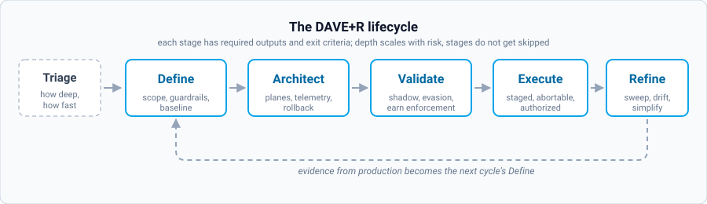

# DAVE+R

**A lifecycle for secure, abuse-resilient edge delivery.**
Define → Architect → Validate → Execute → Refine.

A practical way to design, validate, roll out and continuously improve security controls
without breaking production traffic or the business. It targets the changes that are
easiest to get wrong: edge and WAF rules, cloud posture and connectivity, abuse and bot
defenses, and the governance that keeps all of it maintainable.

Vendor-neutral by design. The differentiator is not a product, it is disciplined execution.

**Current version: v1.1.2** ([changelog](CHANGELOG.md))

---

## What's here

| | |
| :--- | :--- |
| **[DAVE-R-Framework.md](DAVE-R-Framework.md)** | The framework. Start here. |
| **[templates/](templates/)** | Five working templates, one per artifact |
| **[scenarios/](scenarios/)** | Worked examples, including what each one cost |
| **[ai/](ai/)** | Machine-executable spec, gate engine, MCP server, agent skill |
| **[ai/INSTALL.md](ai/INSTALL.md)** | Dependencies and the three ways to run it |
| **[CHANGELOG.md](CHANGELOG.md)** | What changed between versions, and why |

## The lifecycle



A triage gate at the front decides how deep the next four stages go. Everything else runs
in order, produces named artifacts, and has exit criteria you can actually check.

## Core ideas

- Clear scope before change
- Measure before enforce
- Roll out in stages, each with an abort criterion
- Always have a rollback, and know what protects you while it is engaged
- Name three ways around your own control before you enforce it
- Learn and refine continuously, and count whether the system is actually getting simpler

## Who this is for

Security and platform teams shipping production changes. Edge, WAF, API and cloud
security teams. Abuse, bot and fraud teams that care about false positives and business
impact.

## How to use it

Start small. Pick one critical flow (login, checkout, signup, API access), run a full
cycle for that scope, and use the telemetry and outcomes to decide what to expand or
simplify next. The framework scales by repeating the cycle, not by making it heavier.

Depth scales with risk. The stages do not get skipped.

## Running it with an agent

The framework is expressed in a form an AI agent can execute, in [`ai/`](ai/): 44 core
gates plus 19 adapter gates, four domain adapters, JSON schemas for every artifact, an
MCP server and an agent skill.

The point is not automation for its own sake. A language model will produce a plausible
false positive rate as readily as a true one, so the AI layer's central mechanism is
**evidence typing**: every value is `asserted`, `observed`, `derived` or `unmeasured`, and
gates that authorize enforcement read only the middle two. An agent that cannot measure
must block rather than estimate.

Three things an agent may never write: the go/no-go signature, the enforcement
authorization, and any exception approval. That boundary is enforced cryptographically,
not by convention.

Dependencies are Python 3.9+ and PyYAML. Nothing else is required for the gates.
Full setup, including the MCP server: [ai/INSTALL.md](ai/INSTALL.md).

```bash
python3 ai/engine/daver_cli.py adapters
python3 ai/engine/daver_cli.py questions a-edge-waf
python3 ai/engine/daver_cli.py scaffold a-edge-waf my-change -o cycle.yaml
python3 ai/engine/daver_cli.py check cycle.yaml
```

Read [`ai/spec/THREAT-MODEL.md`](ai/spec/THREAT-MODEL.md) before pointing an agent at
anything that matters.

Using DAVE+R with no agent at all remains entirely valid. The lifecycle came first and
stands on its own.

## License and attribution

Licensed under [Creative Commons Attribution 4.0 International](LICENSE) (CC BY 4.0).
Free to use, share and adapt, including commercially, with attribution.

> DAVE+R Framework by Demetrios Petropoulos (CC BY 4.0). Changes were made.

Attribution does not include the right to use the author's name or marks to imply
endorsement of a derivative work.

## Versioning

Semantic versioning. MAJOR alters the lifecycle or core principles, MINOR adds modules or
significant patterns, PATCH clarifies text or fixes defects. Changes between versions are
intentional and documented in [CHANGELOG.md](CHANGELOG.md).
